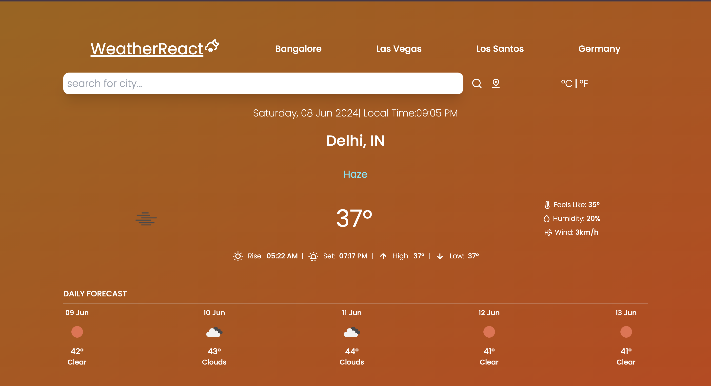
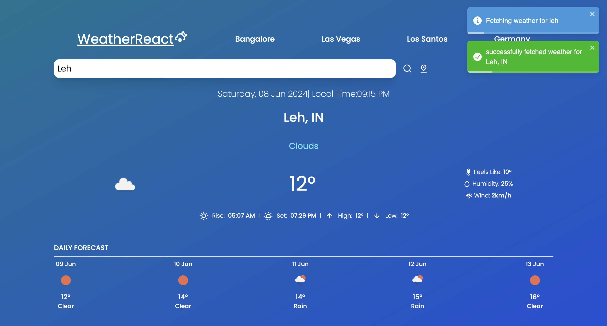
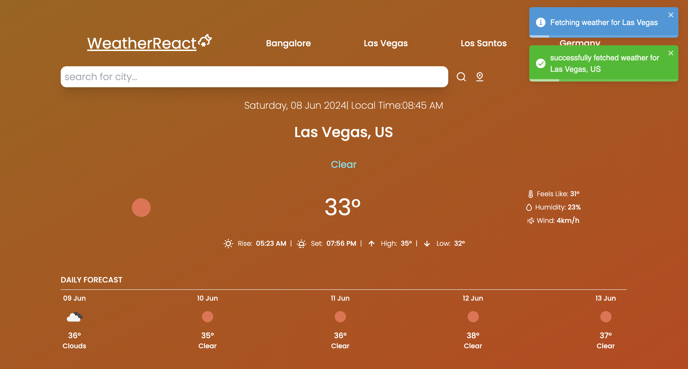
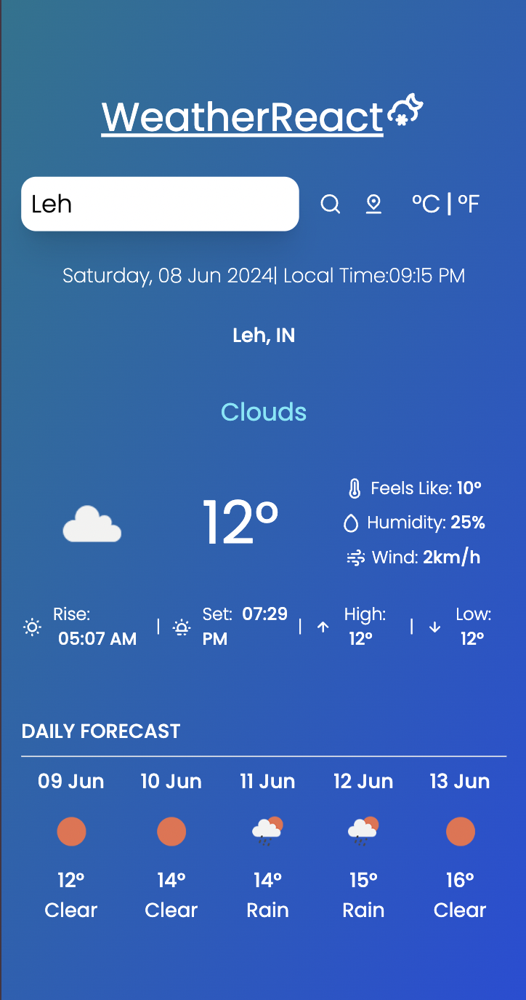

# Weather App

Developed a Responsive React application that enables users to access real-time weather updates and a 5-day forecast, including details such as high and low temperatures, as well as humidity levels. And user can click on the location icon to check the weather for their current location. User can interchange units between celcius and fahrenheit.

## Installation

Clone the project and install the dependencies

```bash
  cd weather_app
  npm install 

```

Generate your OpenweatherAPI and paste it in API_KEY in WeatherServices.js.

And then start the local server

```bash
  npm start

```
## Demo

link to demo

https://weather-app-kshitiz.netlify.app/
## Screenshots

### Landing Page


### Fetching Data from Cooler Place


### Fetching data outside India


### Responsive Design

